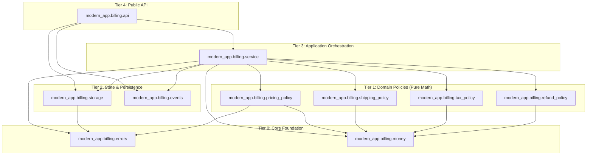

# Aegis ContractLock — Modernization Architecture Plan

**System:** Aegis ContractLock Billing System Modernization  
**Role:** Modernization Architect  
**Status:** Architecture Complete & Validated  
**Candidate Target:** `modern_app/billing/`  
**Governing Standard:** `.bobrules`  
**Sealed Baseline SHA-256:** `2fd2c2f96614e5bcf8fa807b5c1b777fc702f53707be047ddf01c5a852680da7`  
**Contract Coverage:** 86 Scenarios, 100 Workflow Steps, 231 Invariants (`READY`)  

---

## 1. Executive Summary

This architecture plan establishes the replacement design for the legacy billing monolith (`legacy_app/billing/monolith.py`) under `modern_app/billing/`. Modernization is conducted under strict clean-room governance: zero imports from `legacy_app`, zero delegation of business logic to legacy code, zero circular dependencies, zero floating-point financial arithmetic, and 100% behavioral equivalence across the sealed scenario corpus.

Through parallel architectural analysis conducted by three specialized subagents:
- **Subagent A (Responsibility Decomposer)** discovered 22 distinct responsibilities currently tangled within the legacy monolith.
- **Subagent B (Dependency & Boundary Architect)** formulated a 5-tier layered architecture consisting of 11 cohesive modules with strictly unidirectional downward dependencies.
- **Subagent C (Behavioral Risk Guardian)** compiled a 22-risk Behavioral Risk Register identifying the top preservation hazards across asymmetric rounding modes, pre-discount vs. post-discount calculation bases, proportional discount residual distribution, permissive manual-review re-submissions, and blind idempotency replays.

This plan provides all technical specifications, interface contracts, precision policies, error models, and an implementation roadmap required for Task 3 to implement `modern_app/billing/` without making ad-hoc design decisions.

---

## 2. Legacy Structural Analysis

Factual, measurable characteristics of the legacy reference implementation (`legacy_app/billing/monolith.py`), derived directly via AST analysis (`aegis.architecture.analyze_python_tree`) and codebase inspection:

### 2.1 Concrete Structural Metrics

| Structural Dimension | Measured Legacy Value | Source / Methodology |
|---|---|---|
| **Python Module Count** | `1` | `legacy_app/billing/monolith.py` |
| **Physical Line Count** | `469` lines | Direct file line count |
| **Non-Comment, Non-Empty LOC** | `381` LOC | Aegis AST analyzer (`aegis.architecture`) |
| **Total Class Count** | `6` | 5 Exception classes + `LegacyBillingSystem` |
| **Total Function / Method Count** | `12` | 2 helpers (`_money`, `_money_s`) + 1 factory (`create_service`) + 9 methods |
| **Internal Dependency Edges** | `0` | Self-contained single module |
| **Circular Dependencies** | `0` | None |
| **Legacy Imports from Other Billing Modules** | `0` | None |
| **Distinct Responsibilities** | `22` | Responsibility Decomposition analysis |
| **Mutable State Stores** | `6` | `_invoices`, `_refunds`, `_ledger`, `_audit`, `_audit_seq`, `_idempotency` |
| **Public Entry Point** | `LegacyBillingSystem.execute` | Dynamic operation dispatcher |
| **Public Factory Spec** | `legacy_app.billing.monolith:create_service` | `aegis_contract.yaml#L6` |

### 2.2 Major Coupling Points & Flaws
1. **Conflation of Policy and Persistence:** Pricing rules, regional taxation matrices, shipping brackets, and refund eligibility windows are embedded directly alongside in-memory state manipulation, dictionary mutation, and audit sequencing.
2. **Global State Mutation within Pipeline Logic:** `_create_invoice` and `_refund_invoice` mutate `_invoices`, `_refunds`, `_ledger`, `_audit`, and `_idempotency` inline across complex calculation code.
3. **Implicit Rounding Dependencies:** Arithmetic rounding (`ROUND_HALF_UP`) and Banker's rounding (`ROUND_HALF_EVEN`) are applied ad-hoc without formal encapsulation, making subtle calculation drifts likely during refactoring.
4. **Tight Serialization Coupling:** Public API dictionaries and internal persistence storage formats are identical, offering no internal domain isolation.

---

## 3. Responsibility Decomposition

The legacy monolith tangles 22 distinct responsibilities. Every responsibility is characterized below by its behavior, state footprint, dependencies, and target modular allocation.

| ID | Responsibility | Behavior Owned | State Read | State Written | Dependencies | Target Module |
|---|---|---|---|---|---|---|
| **R01** | Public Protocol Dispatch | Routes `"create_invoice"` and `"refund_invoice"`; rejects other operations with `ValidationError`. | None | None | R02, R04, R21, R22 | `api.py` |
| **R02** | Request Payload Validation | Validates operation ID, customer, region, items, SKU, category, qty, price, payment method, refund hours. | None | None | R04, R05 | `service.py` / `pricing_policy.py` |
| **R03** | Account Status Enforcement | Checks `customer.status == "SUSPENDED"`; raises `AccountSuspendedError`. | Customer payload | None | R04 | `service.py` |
| **R04** | Domain Error Hierarchy | Defines custom exceptions with strict class `.code` attributes. | None | None | Standard `Exception` | `errors.py` |
| **R05** | Monetary Precision & Rounding | Quantizes currency to cents via `ROUND_HALF_UP` and `ROUND_HALF_EVEN`; formats to 2, 4, 5 decimals. | None | None | Python `decimal` | `money.py` |
| **R06** | Customer-Tier Volume Pricing | Brackets subtotal for VIP (3%, 7%, 10%), BUSINESS (0%, 4%, 6%), and RETAIL (0%). | None | None | R05 | `pricing_policy.py` |
| **R07** | Coupon Stacking & Capping | Evaluates `WELCOME10` (+10%, 15% cap) and `FIXED25` ($\ge \$250$ threshold); caps discount at subtotal. | None | None | R04, R05, R06 | `pricing_policy.py` |
| **R08** | Regional Shipping Calculation | Evaluates shipping fee on **pre-discount subtotal** (`US_CA`/`US_NY`: $150, `EU_DE`/`UK`: $250, `EXPORT`: $35). | None | None | R05 | `shipping_policy.py` |
| **R09** | Proportional Line Discount Allocation | Allocates discount proportionally across items ($0 \dots N-2$ via `HALF_EVEN`; $N-1$ absorbs residual). | None | None | R05 | `tax_policy.py` |
| **R10** | Regional Taxation & Breakdown | Computes regional taxes by item category (`US_CA`, `US_NY`, `EU_DE`, `UK`, `EXPORT`); clamps taxable base. | None | None | R05, R09 | `tax_policy.py` |
| **R11** | Payment Surcharge Evaluation | Validates method; applies 1.5% fee on `discounted_subtotal \ge \$1,500.00` for `CARD` (`ROUND_HALF_UP`). | None | None | R04, R05 | `pricing_policy.py` |
| **R12** | Deterministic ID Generation | Generates `"INV-"` and `"RFD-"` prefixed IDs from SHA-256 hash of `operation_id` (10 hex chars uppercase). | None | None | Python `hashlib` | `service.py` |
| **R13** | Invoice Structure Assembly | Assembles canonical invoice dictionary; quantizes grand total (`ROUND_HALF_UP`). | None | None | R05 | `service.py` |
| **R14** | Refund Window & Fee Evaluation | Classifies window ($0-24\text{h}$: 0%, $25-72\text{h}$: 5% `HALF_EVEN`, $>72\text{h}$: `MANUAL_REVIEW`); computes payout. | None | None | R05 | `refund_policy.py` |
| **R15** | Refund Duplicate Prevention | Ensures target invoice exists; rejects duplicate if prior refund is `APPROVED`; mutates invoice to `"REFUNDED"`. | `_invoices`, `_refunds` | `_invoices` (status) | R04, R17 | `storage.py` / `service.py` |
| **R16** | Idempotency Caching | Replays cached response for duplicate `f"{operation}:{operation_id}"`; prevents duplicate side effects. | `_idempotency` | `_idempotency` | Python `copy` | `storage.py` |
| **R17** | In-Memory Entity Storage | Stores invoice and refund records in dictionary storage; provides lookups and isolated deepcopies. | `_invoices`, `_refunds` | `_invoices`, `_refunds` | Python `copy` | `storage.py` |
| **R18** | Ledger Journaling | Records double-entry financial events: `INVOICE_CHARGE` (`DEBIT`) and approved `REFUND` (`CREDIT`). | `_ledger` | `_ledger` | R05 | `storage.py` |
| **R19** | Audit Trail Sequencing | Monotonically increments `_audit_seq` (1-indexed); records `INVOICE_CREATED`, `REFUND_APPROVED`, etc. | `_audit`, `_audit_seq` | `_audit`, `_audit_seq` | Python `copy` | `events.py` |
| **R20** | State Snapshot Serialization | Exports sorted invoices (`invoice_id`), sorted refunds (`refund_id`), ledger, and audit; excludes caches. | `_invoices`, `_refunds`, `_ledger`, `_audit` | None | Python `copy` | `storage.py`, `events.py`, `service.py` |
| **R21** | Invoice Creation Orchestration | Coordinates the end-to-end 15-step invoice creation workflow. | `_idempotency` | `_invoices`, `_ledger`, `_audit`, `_idempotency` | R02, R05-R13, R16-R20 | `service.py` |
| **R22** | Refund Processing Orchestration | Coordinates the end-to-end 11-step refund workflow. | `_idempotency`, `_invoices`, `_refunds` | `_refunds`, `_invoices`, `_ledger`, `_audit`, `_idempotency` | R02, R04, R05, R12, R14-R20 | `service.py` |

---

## 4. Proposed Module Structure

To achieve clean cohesion, prevent micro-fragmentation, and strictly comply with Aegis AST analyzer requirements, the modern implementation is structured as follows under `modern_app/billing/`:

```
modern_app/
├── __init__.py                       # Package root marker
└── billing/
    ├── __init__.py                   # Re-exports create_service
    ├── api.py                        # Tier 4: Public factory & entry point
    ├── service.py                    # Tier 3: Core workflow orchestrator (BillingService)
    ├── pricing_policy.py             # Tier 1: Discounts, coupons, and payment fees
    ├── shipping_policy.py            # Tier 1: Shipping schedule & pre-discount thresholds
    ├── tax_policy.py                 # Tier 1: Tax rules & proportional line allocation
    ├── refund_policy.py              # Tier 1: Refund windows & Banker's rounding fee
    ├── storage.py                    # Tier 2: Entity persistence & idempotency cache
    ├── events.py                     # Tier 2: Monotonic sequence audit logger
    ├── errors.py                     # Tier 0: Domain exceptions matching Aegis verifier
    └── money.py                      # Tier 0: Decimal precision & rounding utilities
```

### Module Responsibilities & AST Metrics Projections

| Module | Architectural Role | Projected LOC | Legacy Monolith LOC Ratio |
|---|---|---|---|
| `modern_app/billing/__init__.py` | Package entry point & export | ~5 | < 2% |
| `modern_app/billing/api.py` | Verifier factory (`create_service`) | ~20 | < 6% |
| `modern_app/billing/service.py` | Workflow orchestration (`BillingService`) | ~160 | ~42% |
| `modern_app/billing/pricing_policy.py` | Customer tiers, coupons, card fee | ~65 | ~17% |
| `modern_app/billing/shipping_policy.py`| Regional shipping rules | ~25 | ~7% |
| `modern_app/billing/tax_policy.py` | Proportional allocation & regional tax | ~85 | ~22% |
| `modern_app/billing/refund_policy.py`  | Refund windows & fee computation | ~40 | ~10% |
| `modern_app/billing/storage.py`        | Entity repository & idempotency cache | ~80 | ~21% |
| `modern_app/billing/events.py`         | Audit log & monotonic sequencing | ~30 | ~8% |
| `modern_app/billing/errors.py`         | Exception hierarchy with `.code` | ~30 | ~8% |
| `modern_app/billing/money.py`          | Decimal quantization & formatting | ~35 | ~9% |
| **Entire Billing Subsystem** | **11 Modules** | **~575 Total LOC** | **Largest Module: ~160 LOC vs 381 LOC** |

---

## 5. Module Interface Contracts

### 5.1 `modern_app.billing.money`
- **Responsibility:** Centralizes financial quantization, arithmetic rounding, Banker's rounding, and canonical string formatting.
- **Public Functions:**
  - `quantize_money(value: Any, rounding=ROUND_HALF_UP) -> Decimal`: Converts numeric input to cents.
  - `quantize_even(value: Any) -> Decimal`: Banker's rounding to cents (`ROUND_HALF_EVEN`).
  - `format_money(value: Decimal) -> str`: Formats to 2 decimal places (`f"{value:.2f}"`).
  - `format_rate_4(value: Decimal) -> str`: Formats discount/fee rates to 4 decimal places (`f"{value:.4f}"`).
  - `format_rate_5(value: Decimal) -> str`: Formats tax rates to 5 decimal places (`f"{value:.5f}"`).
- **State Ownership:** Completely stateless.
- **Allowed Imports:** `decimal.Decimal`, `decimal.ROUND_HALF_UP`, `decimal.ROUND_HALF_EVEN`, `typing.Any`.
- **Forbidden Imports:** Any `modern_app.*`, any `legacy_app.*`.
- **Behavioral Invariants:** Quantum is immutable `Decimal("0.01")`. Rounding must never silently fallback to default float behavior.

### 5.2 `modern_app.billing.errors`
- **Responsibility:** Domain exception hierarchy matching exact class names and `.code` attributes expected by `aegis/runner.py`.
- **Public Classes:**
  - `BillingError(Exception)`: Base error with class attribute `code = "BILLING_ERROR"`.
  - `ValidationError(BillingError)`: `code = "VALIDATION_ERROR"`.
  - `AccountSuspendedError(BillingError)`: `code = "ACCOUNT_SUSPENDED"`.
  - `InvoiceNotFoundError(BillingError)`: `code = "INVOICE_NOT_FOUND"`.
  - `RefundAlreadyProcessedError(BillingError)`: `code = "REFUND_ALREADY_PROCESSED"`.
- **State Ownership:** Completely stateless.
- **Allowed Imports:** Standard library only.
- **Forbidden Imports:** Any `modern_app.*`, any `legacy_app.*`.
- **Behavioral Invariants:** All exceptions must define static string `code` attribute. String messages must strictly reproduce legacy error text.

### 5.3 `modern_app.billing.pricing_policy`
- **Responsibility:** Pure business policies for customer tier discounts, coupon stacking/capping, and payment card fees.
- **Public Functions:**
  - `calculate_tier_discount(tier: str, subtotal: Decimal) -> Decimal`: Evaluates volume discount based on subtotal.
  - `apply_coupon(coupon_code: Optional[str], tier_rate: Decimal, subtotal: Decimal) -> Tuple[Decimal, Decimal]`: Evaluates coupon code, returns `(discount_rate, fixed_coupon)`. Raises `ValidationError` on unrecognized coupon.
  - `calculate_discount(subtotal: Decimal, discount_rate: Decimal, fixed_coupon: Decimal) -> Tuple[Decimal, Decimal]`: Applies Banker's rounding (`ROUND_HALF_EVEN`), caps at subtotal, computes `(total_discount, discounted_subtotal)`.
  - `calculate_card_fee(payment_method: str, discounted_subtotal: Decimal) -> Decimal`: Applies 1.5% fee on `discounted_subtotal \ge \$1,500.00` for `CARD` payments using `ROUND_HALF_UP`.
- **State Ownership:** Completely stateless.
- **Allowed Imports:** `decimal.Decimal`, `decimal.ROUND_HALF_EVEN`, `decimal.ROUND_HALF_UP`, `typing.Optional, Tuple`, `from .money import MONEY`, `from .errors import ValidationError`.
- **Forbidden Imports:** `service.py`, `storage.py`, `events.py`, `api.py`, `legacy_app.*`.
- **Behavioral Invariants:** Tier brackets are inclusive of lower threshold (`>=`). `WELCOME10` capped at 0.1500. `FIXED25` silently yields $0.00 below $250.00. Card fee evaluated on discounted subtotal only.

### 5.4 `modern_app.billing.shipping_policy`
- **Responsibility:** Regional shipping cost calculation based strictly on pre-discount merchandise subtotal.
- **Public Functions:**
  - `calculate_shipping(region: str, pre_discount_subtotal: Decimal) -> Decimal`:
    - `US_CA`, `US_NY`: $0.00 if subtotal $\ge \$150.00$, else $12.00.
    - `EU_DE`, `UK`: $0.00 if subtotal $\ge \$250.00$, else $18.00.
    - `EXPORT`: Flat $35.00.
- **State Ownership:** Completely stateless.
- **Allowed Imports:** `decimal.Decimal`, `from .money import MONEY`.
- **Forbidden Imports:** `service.py`, `storage.py`, `events.py`, `api.py`, `legacy_app.*`.
- **Behavioral Invariants:** Basis is strictly pre-discount subtotal. Thresholds are inclusive (`>=`).

### 5.5 `modern_app.billing.tax_policy`
- **Responsibility:** Multi-line proportional discount allocation, residual distribution to final line, and regional tax calculations.
- **Public Functions:**
  - `allocate_discounts(lines: List[Dict[str, Any]], subtotal: Decimal, total_discount: Decimal) -> List[Decimal]`: Proportional allocation; lines $0 \dots N-2$ receive `ROUND_HALF_EVEN` shares; line $N-1$ receives exact residual.
  - `calculate_tax(region: str, lines: List[Dict[str, Any]], subtotal: Decimal, total_discount: Decimal) -> Tuple[Decimal, List[Dict[str, str]]]`: Calculates per-line taxable bases, applies regional category rates, quantizes line tax with `ROUND_HALF_UP`, and aggregates total tax. Short-circuits zero subtotal to `(Decimal("0.00"), [])`.
- **State Ownership:** Completely stateless.
- **Allowed Imports:** `decimal.Decimal`, `decimal.ROUND_HALF_EVEN`, `decimal.ROUND_HALF_UP`, `typing.List, Dict, Tuple, Any`, `from .money import MONEY, format_money, format_rate_5`.
- **Forbidden Imports:** `service.py`, `storage.py`, `events.py`, `api.py`, `legacy_app.*`.
- **Behavioral Invariants:** Allocation preserves total discount sum exactly. Line taxable base clamped at `max(0.00, line_total - share)`. Zero subtotal produces empty breakdown `[]`.

### 5.6 `modern_app.billing.refund_policy`
- **Responsibility:** Refund window classification, Banker's rounding fee calculation, and net payout determination.
- **Public Functions:**
  - `evaluate_refund(original_total: Decimal, hours_since_purchase: int) -> Tuple[str, Decimal, Decimal, Decimal]`:
    - Hours $\le 24$: `APPROVED`, rate 0.0000, fee $0.00, full payout.
    - Hours $25-72$: `APPROVED`, rate 0.0500, fee `(original_total * 0.05).quantize(ROUND_HALF_EVEN)`, payout `(original_total - fee).quantize(ROUND_HALF_UP)`.
    - Hours $> 72$: `MANUAL_REVIEW`, rate 0.0000, fee $0.00, payout $0.00.
    - Returns `(status, fee_rate, fee, refund_amount)`.
- **State Ownership:** Completely stateless.
- **Allowed Imports:** `decimal.Decimal`, `decimal.ROUND_HALF_EVEN`, `decimal.ROUND_HALF_UP`, `typing.Tuple`, `from .money import MONEY`.
- **Forbidden Imports:** `service.py`, `storage.py`, `events.py`, `api.py`, `legacy_app.*`.
- **Behavioral Invariants:** Window boundaries are inclusive ($\le 24$, $\le 72$). Refund fee uses Banker's rounding (`ROUND_HALF_EVEN`). Net payout uses Arithmetic rounding (`ROUND_HALF_UP`).

### 5.7 `modern_app.billing.storage`
- **Responsibility:** In-memory repository for invoices, refunds, ledger entries, and idempotency cache.
- **Public Class:** `BillingStorage`
  - `get_idempotent(key: str) -> Optional[Dict[str, Any]]`
  - `save_idempotent(key: str, data: Dict[str, Any]) -> None`
  - `get_invoice(invoice_id: str) -> Optional[Dict[str, Any]]`
  - `save_invoice(invoice: Dict[str, Any]) -> None`
  - `update_invoice_status(invoice_id: str, status: str) -> None`
  - `has_approved_refund(invoice_id: str) -> bool`
  - `save_refund(refund: Dict[str, Any]) -> None`
  - `record_ledger_debit(invoice_id: str, amount_s: str) -> None`
  - `record_ledger_credit(invoice_id: str, refund_id: str, amount_s: str) -> None`
  - `snapshot() -> Dict[str, Any]`: Returns sorted invoices, sorted refunds, and ledger copy.
- **State Ownership:** Owns `_invoices`, `_refunds`, `_ledger`, and `_idempotency`.
- **Allowed Imports:** `copy.deepcopy`, `typing.Dict, List, Optional, Any`, `from .errors import InvoiceNotFoundError, RefundAlreadyProcessedError`.
- **Forbidden Imports:** `service.py`, `api.py`, policy modules, `legacy_app.*`.
- **Behavioral Invariants:** All reads and writes must deepcopy data. Invoices sorted by `invoice_id` ascending; refunds sorted by `refund_id` ascending; ledger in append order.

### 5.8 `modern_app.billing.events`
- **Responsibility:** Centralized audit event logging with monotonic integer sequencing.
- **Public Class:** `AuditLog`
  - `emit(event_type: str, data: Dict[str, Any]) -> None`: Increments sequence counter and appends event.
  - `snapshot() -> List[Dict[str, Any]]`: Returns deepcopy of audit log.
- **State Ownership:** Owns `_audit: List[Dict[str, Any]]` and `_audit_seq: int` (initialized to 0).
- **Allowed Imports:** `copy.deepcopy`, `typing.Dict, List, Any`.
- **Forbidden Imports:** All other billing modules, `legacy_app.*`.
- **Behavioral Invariants:** Sequence begins at 1 and increments strictly monotonically by 1 per event. Events appended in chronological order.

### 5.9 `modern_app.billing.service`
- **Responsibility:** Application workflow orchestrator implementing the public execution interface (`execute`, `snapshot_state`).
- **Public Class:** `BillingService`
  - `__init__(storage: BillingStorage, events: AuditLog)`
  - `execute(operation: str, payload: Dict[str, Any]) -> Dict[str, Any]`
  - `snapshot_state() -> Dict[str, Any]`
- **State Ownership:** Coordinates `storage` and `events`; owns no direct collections.
- **Allowed Imports:**
  - Standard library: `copy.deepcopy`, `hashlib.sha256`, `decimal.Decimal`, `decimal.ROUND_HALF_UP`, `typing.Dict, Any, List`.
  - Tier 0: `money`, `errors`.
  - Tier 1: `pricing_policy`, `shipping_policy`, `tax_policy`, `refund_policy`.
  - Tier 2: `storage`, `events`.
- **Forbidden Imports:** `api.py`, `legacy_app.*`.
- **Behavioral Invariants:** Guarantees atomic, side-effect-free failures. Unsupported operations raise `ValidationError`. Successful results cached in idempotency store.

### 5.10 `modern_app.billing.api`
- **Responsibility:** Public factory required by Aegis contract.
- **Public Function:**
  - `create_service() -> BillingService`: Instantiates a fresh `BillingService` with new `BillingStorage()` and `AuditLog()`.
- **State Ownership:** Completely stateless.
- **Allowed Imports:** `from .service import BillingService`, `from .storage import BillingStorage`, `from .events import AuditLog`.
- **Forbidden Imports:** Policy modules, `legacy_app.*`.
- **Behavioral Invariants:** Returns a pristine service instance with zero shared state across calls.

---

## 6. Dependency Rules

To ensure clean architecture and eliminate cycles, a strict **5-Tier Downward Dependency Model** is enforced:

```
Tier 4: Public API Layer               (api.py)
   │
   ▼
Tier 3: Application Orchestration Layer (service.py)
   │
   ├───────────────────────────────┐
   ▼                               ▼
Tier 2: State & Persistence Layer   Tier 1: Domain Policy Layer
(storage.py, events.py)             (pricing_policy.py, shipping_policy.py,
   │                                tax_policy.py, refund_policy.py)
   │                               │
   └───────────────┬───────────────┘
                   ▼
Tier 0: Core Foundation Layer        (errors.py, money.py)
```

### 6.1 Permitted Dependency Matrix

| Caller Module | Allowed Imports | Forbidden Imports |
|---|---|---|
| `api.py` (Tier 4) | `service`, `storage`, `events` | Policy modules, `errors`, `money`, `legacy_app.*` |
| `service.py` (Tier 3) | Tier 2 (`storage`, `events`), Tier 1 (all policies), Tier 0 (`errors`, `money`) | `api.py`, `legacy_app.*` |
| `storage.py` (Tier 2) | Tier 0 (`errors`) | `service`, `api`, all policies, `events`, `legacy_app.*` |
| `events.py` (Tier 2) | None (Standard library only) | All other modules, `legacy_app.*` |
| `pricing_policy.py` (Tier 1) | Tier 0 (`money`, `errors`) | Tier 2, Tier 3, Tier 4, other policies, `legacy_app.*` |
| `shipping_policy.py` (Tier 1) | Tier 0 (`money`) | Tier 2, Tier 3, Tier 4, other policies, `legacy_app.*` |
| `tax_policy.py` (Tier 1) | Tier 0 (`money`) | Tier 2, Tier 3, Tier 4, other policies, `legacy_app.*` |
| `refund_policy.py` (Tier 1) | Tier 0 (`money`) | Tier 2, Tier 3, Tier 4, other policies, `legacy_app.*` |
| `errors.py` (Tier 0) | None (Standard library only) | All billing modules, `legacy_app.*` |
| `money.py` (Tier 0) | None (Standard library only) | All billing modules, `legacy_app.*` |

### 6.2 Cycle Prevention Proof
Let $L(M)$ be the architectural tier level of module $M$.
For every internal dependency edge $(A \to B)$, $L(A) > L(B)$ strictly holds.
Because tier levels strictly decrease along every directed edge, the dependency graph is an **Acyclic Directed Graph (DAG)**. Circular dependencies are mathematically impossible under this structure, ensuring `modern_has_no_cycles` evaluates to `PASS`.

---

## 7. Mermaid Dependency Diagram



---

## 8. State & Persistence Design

### 8.1 State Ownership Model
Observable business state and internal runtime caches are strictly partitioned:
1. **`BillingStorage` (`storage.py`)** encapsulates:
   - `_invoices: Dict[str, Dict[str, Any]]`: Invoices indexed by `invoice_id`.
   - `_refunds: Dict[str, Dict[str, Any]]`: Refunds indexed by `refund_id`.
   - `_ledger: List[Dict[str, Any]]`: Double-entry accounting log.
   - `_idempotency: Dict[str, Dict[str, Any]]`: Execution response cache keyed by `<operation>:<operation_id>`.
2. **`AuditLog` (`events.py`)** encapsulates:
   - `_audit: List[Dict[str, Any]]`: Chronological audit event log.
   - `_audit_seq: int`: 1-based monotonic sequence counter.

### 8.2 Ledger Effects & Financial Journaling Invariants
- **Invoice Charge:**
  - Emitted upon successful invoice creation.
  - Format: `{"type": "INVOICE_CHARGE", "invoice_id": invoice_id, "amount": grand_total_s, "direction": "DEBIT"}`.
- **Approved Refund:**
  - Emitted upon approved refund processing ($0-72\text{h}$).
  - Format: `{"type": "REFUND", "invoice_id": invoice_id, "refund_id": refund_id, "amount": refund_amount_s, "direction": "CREDIT"}`.
- **Manual Review Refund:**
  - Strictly **no** ledger record is appended.

### 8.3 Audit Trail Invariants
- Each event record is formatted as:
  ```python
  {
      "seq": self._audit_seq,  # int >= 1, incremented before appending
      "event": event_type,     # str
      "data": deepcopy(data)   # dict
  }
  ```
- Events:
  - `INVOICE_CREATED`: `{"invoice_id": ..., "customer_id": ..., "amount": ...}`
  - `REFUND_APPROVED`: `{"invoice_id": ..., "refund_id": ..., "amount": ...}`
  - `REFUND_MANUAL_REVIEW`: `{"invoice_id": ..., "refund_id": ..., "amount": "0.00"}`

### 8.4 State Snapshot Protocol (`snapshot_state()`)
The observable state snapshot returned to Aegis must be constructed as:
```python
{
    "invoices": [deepcopy(self._invoices[k]) for k in sorted(self._invoices)],
    "refunds":  [deepcopy(self._refunds[k]) for k in sorted(self._refunds)],
    "ledger":   deepcopy(self._ledger),
    "audit":    deepcopy(self._audit),
}
```
- Invoices are sorted alphabetically by `invoice_id`.
- Refunds are sorted alphabetically by `refund_id`.
- Ledger preserves historical append order.
- Audit preserves chronological sequence order.
- Internal caches (`_idempotency`, `_audit_seq`) are strictly omitted.

---

## 9. Money & Precision Strategy

### 9.1 Core Precision Directives
1. **Binary Float Prohibition:** Binary floating-point types (`float`) are strictly forbidden for financial calculations. All financial values must use `decimal.Decimal`.
2. **Standard Quantum:** Monetary values are quantized to `Decimal("0.01")` (cents).
3. **Format Standards:**
   - Currency: `f"{value:.2f}"` (e.g. `"12.50"`)
   - Discount & Fee Rates: `f"{rate:.4f}"` (e.g. `"0.1000"`, `"0.0150"`)
   - Tax Rates: `f"{rate:.5f}"` (e.g. `"0.07250"`, `"0.08875"`)

### 9.2 Rounding Mode Assignment Matrix

| Calculation Step | Arithmetic (`ROUND_HALF_UP`) | Banker's (`ROUND_HALF_EVEN`) | Rationale / Legacy Source |
|---|:---:|:---:|---|
| **Unit Price Input Normalization** | **YES** | NO | `monolith.py#L127` (`_money(raw)`) |
| **Line Item Total** (`unit_price * qty`) | **YES** | NO | `monolith.py#L139` (Rounded prior to subtotal) |
| **Merchandise Subtotal** | **YES** | NO | `monolith.py#L151` |
| **Tier Percentage Discount** | NO | **YES** | `monolith.py#L169` (`ROUND_HALF_EVEN`) |
| **Combined Coupon Discount** | NO | **YES** | `monolith.py#L174` (`ROUND_HALF_EVEN`) |
| **Discounted Merchandise Subtotal** | **YES** | NO | `monolith.py#L176` (`ROUND_HALF_UP`) |
| **Proportional Discount Allocations** ($0 \dots N-2$) | NO | **YES** | `monolith.py#L308` (`ROUND_HALF_EVEN`) |
| **Final Line Discount Residual** ($N-1$) | NO | **YES** | `monolith.py#L303` (`ROUND_HALF_EVEN`) |
| **Line Taxable Base** (`line_total - share`) | **YES** | NO | `monolith.py#L320` (`ROUND_HALF_UP`) |
| **Line Tax Amount** | **YES** | NO | `monolith.py#L347` (`ROUND_HALF_UP`) |
| **Total Tax Amount** | **YES** | NO | `monolith.py#L359` (`ROUND_HALF_UP`) |
| **Invoice Card Service Fee** (1.5%) | **YES** | NO | `monolith.py#L197` (`ROUND_HALF_UP`) |
| **Grand Total** | **YES** | NO | `monolith.py#L201` (`ROUND_HALF_UP`) |
| **Refund Fee** (5.0%) | NO | **YES** | `monolith.py#L403` (`ROUND_HALF_EVEN`) |
| **Refund Net Payout Amount** | **YES** | NO | `monolith.py#L406` (`ROUND_HALF_UP`) |

---

## 10. Behavioral Risk Register

The Behavioral Risk Register catalogs all 22 identified behavioral preservation risks across 10 operational domains, highlighting the **Top 5 Most Critical Preservation Hazards**.

### 10.1 Top 5 Most Critical Preservation Hazards

1. **Hazard 1: Asymmetric Rounding Modes Across Calculation Boundaries**
   - *Fragility:* Invoice card service fee (1.5%) uses `ROUND_HALF_UP`, while refund fee (5.0%) uses Banker's rounding `ROUND_HALF_EVEN`. Unifying these under a single rounding helper will cause 1-cent discrepancies on half-cent boundaries.
   - *Owning Modules:* `modern_app.billing.pricing_policy`, `modern_app.billing.refund_policy`.
   - *Preservation Rule:* Pass explicit rounding mode parameters; never default. Card fee must use `ROUND_HALF_UP`; refund fee must use `ROUND_HALF_EVEN`.
   - *Contract Tripwires:* `fee_card_at_1500_00`, `rounding_bankers_half_even_discount`, `rounding_refund_fee_half_even`.

2. **Hazard 2: Inverted Calculation Bases (Pre-Discount vs. Post-Discount Subtotal)**
   - *Fragility:* Regional shipping thresholds are evaluated on **pre-discount merchandise subtotal**, whereas the card service fee threshold ($1,500.00) is evaluated on **post-discount merchandise subtotal** (excluding shipping and tax).
   - *Owning Modules:* `modern_app.billing.shipping_policy`, `modern_app.billing.pricing_policy`.
   - *Preservation Rule:* `calculate_shipping` must accept `pre_discount_subtotal`. `calculate_card_fee` must accept `discounted_subtotal`.
   - *Contract Tripwires:* `shipping_pre_discount_subtotal_trap`, `shipping_us_ca_at_150_00`, `fee_card_below_1499_99`, `fee_card_at_1500_00`.

3. **Hazard 3: Multi-Line Proportional Discount Allocation & Final Line Residual Absorption**
   - *Fragility:* Dispersing discounts across items requires proportional allocation using `ROUND_HALF_EVEN` for lines $0 \dots N-2$, with the final line $N-1$ absorbing the exact remaining balance (`total_discount - sum(prior_shares)`). Independent item rounding causes penny leakage and taxable base corruption.
   - *Owning Module:* `modern_app.billing.tax_policy`.
   - *Preservation Rule:* Preserve line index order; allocate lines $0 \dots N-2$ with `ROUND_HALF_EVEN`; force line $N-1$ to absorb the exact residual.
   - *Contract Tripwires:* `rounding_multiline_proportional_residual`.

4. **Hazard 4: Permissive Subsequent Refunds After MANUAL_REVIEW**
   - *Fragility:* Refunds requested after 72 hours enter `MANUAL_REVIEW`, leaving the invoice `"OPEN"`. Duplicate refund checks in `monolith.py` only reject requests if an existing refund has `status == "APPROVED"`. Subsequent requests submitted within 0-72h are allowed and can be approved.
   - *Owning Module:* `modern_app.billing.storage`, `modern_app.billing.service`.
   - *Preservation Rule:* In `has_approved_refund`, check only `refund.status == "APPROVED"`. Do not transition invoice status on `MANUAL_REVIEW`.
   - *Contract Tripwires:* `refund_after_manual_review_allowed`, `refund_duplicate_approved_rejected`, `refund_manual_review_73h`.

5. **Hazard 5: Blind Idempotency Replay Without Payload Validation**
   - *Fragility:* Requests repeating an `operation_id` return the cached response deepcopy immediately, even if the payload fields were tampered with. Implementing modern payload hash validation will cause verifier failure.
   - *Owning Module:* `modern_app.billing.storage`.
   - *Preservation Rule:* Key solely on `f"{operation}:{operation_id}"`. When present in cache, immediately return `deepcopy(cache[key])` without comparing payload contents.
   - *Contract Tripwires:* `idempotency_invoice_tampered_payload`, `idempotency_invoice_exact_replay`, `idempotency_refund_exact_replay`.

### 10.2 Complete Behavioral Risk Matrix (Risks 1–22)

| # | Behavioral Risk | Fragility & Failure Mode | Owning Module | Preservation Implementation Rule | Primary Tripwire Scenarios |
|---|---|---|---|---|---|
| **1** | VIP Volume Thresholds | `< 500` (3%), `500-999.99` (7%), `1000+` (10%). `>` vs `>=` flips rates at boundaries. | `pricing_policy.py` | Use inclusive `>= Decimal("500.00")` and `>= Decimal("1000.00")`. | `bnd_vip_subtotal_499_99`, `bnd_vip_subtotal_500_00`, `bnd_vip_subtotal_1000_00` |
| **2** | Business Volume Thresholds | `< 1000` (0%), `1000-1999.99` (4%), `2000+` (6%). | `pricing_policy.py` | Use inclusive `>= Decimal("1000.00")` and `>= Decimal("2000.00")`. | `bnd_bus_subtotal_999_99`, `bnd_bus_subtotal_1000_00`, `bnd_bus_subtotal_2000_00` |
| **3** | WELCOME10 15% Rate Cap | Adds 10% to tier rate; total percentage capped at 15%. | `pricing_policy.py` | `min(tier_rate + Decimal("0.10"), Decimal("0.15"))`. | `coupon_welcome10_vip_high_capped`, `coupon_welcome10_bus_high_capped` |
| **4** | FIXED25 Subtotal Qualification | Grants $25.00 only if subtotal $\ge \$250.00$; silently $0.00 if below (no error). | `pricing_policy.py` | Check `subtotal >= Decimal("250.00")`; return `0.00` if below; do NOT raise error. | `coupon_fixed25_below_249_99`, `coupon_fixed25_at_250_00` |
| **5** | Total Discount Subtotal Ceiling | Combined discount cannot exceed merchandise subtotal. | `pricing_policy.py` | `min(subtotal, (pct_discount + fixed_coupon).quantize(MONEY, ROUND_HALF_EVEN))`. | `coupon_ceiling_subtotal` |
| **6** | Coupon Payload Key & Casing | Key is `coupon` (not `coupon_code`); codes are case-insensitive. | `service.py` / `pricing_policy.py` | Read `payload.get("coupon")`; normalize to uppercase string. | `coupon_case_insensitivity`, `val_unknown_coupon` |
| **7** | Pre-Subtotal Line Rounding | Line totals rounded `ROUND_HALF_UP` before subtotal accumulation. | `money.py` / `service.py` | `line_total = (unit_price * qty).quantize(MONEY, ROUND_HALF_UP)` then accumulate. | `retail_standard_order`, `default_values_customer_and_item` |
| **8** | Discount Banker's Rounding | Tier percentage discount uses Banker's rounding (`ROUND_HALF_EVEN`). | `pricing_policy.py` | Quantize with `rounding=ROUND_HALF_EVEN`. | `rounding_bankers_half_even_discount` |
| **9** | Proportional Residual Distribution | Lines $0 \dots N-2$ receive `HALF_EVEN` shares; line $N-1$ absorbs residual. | `tax_policy.py` | Strict iteration; final line receives `total_discount - allocated`. | `rounding_multiline_proportional_residual` |
| **10** | Shipping on Pre-Discount Basis | Free shipping thresholds evaluate pre-discount subtotal. | `shipping_policy.py` | Pass `pre_discount_subtotal` to shipping evaluator. | `shipping_pre_discount_subtotal_trap`, `shipping_us_ca_at_150_00` |
| **11** | Card Fee on Post-Discount Basis | 1.5% fee on `discounted_subtotal >= 1500.00` (`ROUND_HALF_UP`). | `pricing_policy.py` | Exclude tax and shipping from fee threshold and fee base. | `fee_card_below_1499_99`, `fee_card_at_1500_00` |
| **12** | Regional Category Tax Rates | Regional rates: `US_CA` (7.25%), `US_NY` (8.875%), `EU_DE` (19%/7%), `UK` (20%), `EXPORT` (0%). | `tax_policy.py` | Apply exact regional rates by category; format rate to 5 decimals. | `tax_us_ca_goods`, `tax_us_ny_digital`, `tax_eu_de_essential`, `tax_uk_goods` |
| **13** | Zero Subtotal Tax Short-Circuit | Zero merchandise subtotal yields $0.00 tax and empty breakdown `[]`. | `tax_policy.py` | Guard: `if subtotal == 0: return Decimal("0.00"), []`. | `tax_zero_subtotal_short_circuit` |
| **14** | Refund Window Hour Boundaries | $\le 24\text{h}$ (0% fee), $\le 72\text{h}$ (5% fee), $> 72\text{h}$ (`MANUAL_REVIEW`). | `refund_policy.py` | Use inclusive checks: `hours <= 24`, `hours <= 72`. | `refund_full_window_24h`, `refund_fee_window_25h`, `refund_manual_review_73h` |
| **15** | Refund Fee Banker's Rounding | 5% refund fee uses Banker's rounding (`ROUND_HALF_EVEN`). | `refund_policy.py` | Quantize fee with `rounding=ROUND_HALF_EVEN`. | `rounding_refund_fee_half_even` |
| **16** | Subsequent Refund After MANUAL_REVIEW | `MANUAL_REVIEW` does not block future refunds; only `APPROVED` blocks. | `storage.py` / `service.py` | Only check `refund.status == "APPROVED"` for duplicates. | `refund_after_manual_review_allowed`, `refund_duplicate_approved_rejected` |
| **17** | Blind Idempotency Replay | Cached dictionary returned immediately on identical operation ID. | `storage.py` | Return `deepcopy(cache[key])` without comparing payload. | `idempotency_invoice_tampered_payload`, `idempotency_invoice_exact_replay` |
| **18** | Ledger Direction & Formatting | Invoices emit `DEBIT` (`INVOICE_CHARGE`); approved refunds emit `CREDIT` (`REFUND`). | `storage.py` | Match exact string literals and format amounts to 2 decimals. | `retail_standard_order`, `refund_full_window_0h` |
| **19** | Monotonic Audit Sequencing | Integer `seq` starts at 1 and increases monotonically across all events. | `events.py` | Atomic counter incremented prior to event record creation. | `refund_full_window_0h`, `refund_manual_review_73h` |
| **20** | Exception Class & `.code` Strings | Exceptions must match exact class names and `.code` attributes. | `errors.py` | Subclass `BillingError`; define class-level `code: str`. | All `val_*` scenarios, `refund_duplicate_approved_rejected` |
| **21** | Side-Effect-Free Failures | Validation or domain errors must cause zero state mutations. | `service.py` | Validate and compute in memory before committing to storage. | All `val_*` scenarios |
| **22** | Field Defaults & Free Items | Defaults: `RETAIL`, `ACTIVE`, `GOODS`, `CARD`. Price $\ge 0.00$ permitted ($0.00 free item). | `service.py` | Apply defaults on missing/empty; check `unit_price < 0` (reject). | `default_values_customer_and_item`, `val_item_zero_qty` |

---

## 11. Error Model

The exception hierarchy in `modern_app/billing/errors.py` preserves complete fidelity with Aegis reflection in `aegis/runner.py`:

```
Built-in Exception
   └── BillingError (code = "BILLING_ERROR")
         ├── ValidationError (code = "VALIDATION_ERROR")
         ├── AccountSuspendedError (code = "ACCOUNT_SUSPENDED")
         ├── InvoiceNotFoundError (code = "INVOICE_NOT_FOUND")
         └── RefundAlreadyProcessedError (code = "REFUND_ALREADY_PROCESSED")
```

### Exception Specification & Error Message Templates

| Exception Class | Normalized Code | Trigger Condition | Exact Message Pattern |
|---|---|---|---|
| `ValidationError` | `"VALIDATION_ERROR"` | Unsupported operation name | `"Unsupported operation: {operation}"` |
| `ValidationError` | `"VALIDATION_ERROR"` | Missing/empty operation ID | `"operation_id is required"` |
| `ValidationError` | `"VALIDATION_ERROR"` | Missing/empty customer ID | `"customer.id is required"` |
| `ValidationError` | `"VALIDATION_ERROR"` | Unknown customer tier | `"Unknown customer tier: {tier}"` |
| `ValidationError` | `"VALIDATION_ERROR"` | Unknown customer region | `"Unknown region: {region}"` |
| `ValidationError` | `"VALIDATION_ERROR"` | Empty items array | `"At least one invoice item is required"` |
| `ValidationError` | `"VALIDATION_ERROR"` | Item missing SKU | `"Each item requires sku"` |
| `ValidationError` | `"VALIDATION_ERROR"` | Unknown item category | `"Unknown category: {category}"` |
| `ValidationError` | `"VALIDATION_ERROR"` | Item quantity $\le 0$ | `"Quantity for {sku} must be > 0"` |
| `ValidationError` | `"VALIDATION_ERROR"` | Item unit price $< 0$ | `"Unit price for {sku} must be >= 0"` |
| `ValidationError` | `"VALIDATION_ERROR"` | Unrecognized coupon code | `"Unknown coupon: {code}"` |
| `ValidationError` | `"VALIDATION_ERROR"` | Unknown payment method | `"Unknown payment_method: {payment_method}"` |
| `ValidationError` | `"VALIDATION_ERROR"` | Missing refund invoice ID | `"invoice_id is required"` |
| `ValidationError` | `"VALIDATION_ERROR"` | Negative refund hours | `"hours_since_purchase must be >= 0"` |
| `AccountSuspendedError` | `"ACCOUNT_SUSPENDED"` | Customer status is `SUSPENDED` | `"Customer {customer_id} is suspended"` |
| `InvoiceNotFoundError` | `"INVOICE_NOT_FOUND"` | Target invoice does not exist | `"{invoice_id}"` (e.g. `"INV-DOESNOTEXIST"`) |
| `RefundAlreadyProcessedError` | `"REFUND_ALREADY_PROCESSED"` | Invoice already has approved refund | `"{invoice_id}"` (e.g. `"INV-2A1714AC6D"`) |

---

## 12. Public Aegis Compatibility Interface

Aegis contract and test runner expectations are fully satisfied:

### 12.1 Factory Specification
- **Factory Import String:** `modern_app.billing.api:create_service` (configured in `aegis_contract.yaml#L7`).
- **Signature:** `create_service() -> BillingService`
- **Behavior:** Constructs and returns a fresh, isolated `BillingService` instance with separate in-memory storage and audit log.

### 12.2 Execution Interface
- **Method:** `execute(operation: str, payload: dict) -> dict`
- **Supported Operations:**
  - `"create_invoice"`: Accepts invoice payload; returns created invoice dict.
  - `"refund_invoice"`: Accepts refund payload; returns refund record dict.
  - Any other string raises `ValidationError`.

### 12.3 Snapshot Interface
- **Method:** `snapshot_state() -> dict`
- **Output Schema:**
  - `invoices`: list of invoice dicts, sorted by `invoice_id` ascending.
  - `refunds`: list of refund dicts, sorted by `refund_id` ascending.
  - `ledger`: list of ledger entries in chronological insertion order.
  - `audit`: list of audit events with 1-based integer `seq`.

---

## 13. Task 3 Implementation Roadmap

Task 3 will execute a dependency-first, bottom-up implementation across 9 sequential stages. Each stage is validated before proceeding to the next:

```
Stage 1: Core Foundation (errors.py, money.py)
   │
   ▼
Stage 2: Domain Policies (pricing_policy.py, shipping_policy.py, tax_policy.py, refund_policy.py)
   │
   ▼
Stage 3: State & Infrastructure (storage.py, events.py)
   │
   ▼
Stage 4: Workflow Orchestration (service.py)
   │
   ▼
Stage 5: Public API & Integration (api.py, __init__.py)
   │
   ▼
Stage 6: Structural Architecture Gate (aegis.architecture)
   │
   ▼
Stage 7: Full Contract Verification (python -m aegis.cli verify)
   │
   ▼
Stage 8: Verifier Gauntlet Mutation Testing (python -m aegis.cli gauntlet)
   │
   ▼
Stage 9: Modernization Readiness & Certification
```

### Stage Details

| Stage | Target Files | Key Behaviors & Implementation | Verification Checkpoint |
|---|---|---|---|
| **1. Foundation** | `modern_app/billing/errors.py`<br>`modern_app/billing/money.py` | Implement `BillingError` hierarchy with `.code` strings. Implement `quantize_money` (`ROUND_HALF_UP`), `quantize_even` (`ROUND_HALF_EVEN`), and formatting helpers (`format_money`, `format_rate_4`, `format_rate_5`). | Unit test imports and rounding functions; verify zero cross-imports. |
| **2. Policies** | `modern_app/billing/pricing_policy.py`<br>`modern_app/billing/shipping_policy.py`<br>`modern_app/billing/tax_policy.py`<br>`modern_app/billing/refund_policy.py` | Implement volume discount brackets, coupon stacking/capping, card fee calculation, pre-discount shipping schedules, multi-line proportional allocation with residual, regional tax calculation, and refund window evaluation. | Unit test policy edge cases against boundary values ($500, $1000, $2000, $150, $250, $1500, 24h, 72h). |
| **3. State** | `modern_app/billing/storage.py`<br>`modern_app/billing/events.py` | Implement `BillingStorage` (entities, ledger, idempotency) and `AuditLog` (monotonic sequence counter). Ensure defensive deepcopy on all reads/writes. | Unit test entity lookups, idempotency caching, and snapshot sorting. |
| **4. Orchestration** | `modern_app/billing/service.py` | Implement `BillingService` coordinating `create_invoice` (15 steps) and `refund_invoice` (11 steps). Enforce atomic side-effect-free failures. | Validate operation routing and exception propagation. |
| **5. API** | `modern_app/billing/api.py`<br>`modern_app/billing/__init__.py`<br>`modern_app/__init__.py` | Implement `create_service()` factory returning configured `BillingService`. | Verify `from modern_app.billing.api import create_service; s = create_service()`. |
| **6. Architecture Gate** | Structural AST check | Run `python -c "from aegis.architecture import compare_architecture; print(compare_architecture())"`. | **Zero cycles**, **zero legacy imports**, **largest module < 381 LOC**. |
| **7. Contract Verification** | Full verification run | Execute `python -m aegis.cli verify`. | **ACCEPTED verdict**, 0 differences against sealed baseline. |
| **8. Verifier Gauntlet** | Mutation sensitivity check | Execute `python -m aegis.cli gauntlet`. | Gauntlet regressions detected. |
| **9. Certification** | Final readiness report | Execute `python -m aegis.cli readiness` and build evidence certificates. | Modernization readiness approved. |

---

## 14. Verification Strategy

### 14.1 Governing Rules (from `.bobrules`)
- **Rule 1:** Never modify `legacy_app` during modernization.
- **Rule 2:** Never alter a recorded baseline because candidate code fails.
- **Rule 3:** Never weaken, bypass, or special-case the Aegis contract to make candidate code pass.
- **Rule 4:** Never modify Aegis comparison logic merely to eliminate a failing difference.
- **Rule 5:** Any behavioral drift is BLOCKING until candidate code is fixed.
- **Rule 8:** `modern_app` must not import or delegate business logic to `legacy_app`.
- **Rule 11:** Claimed guarantee: "Behavioral equivalence demonstrated across the defined contract and executed scenario corpus."

### 14.2 Verification Commands Sequence for Task 3
```bash
# 1. Structural Architecture Gate (Must show 0 cycles, 0 legacy imports, reduced LOC)
python -c "from aegis.architecture import compare_architecture; import json; print(json.dumps(compare_architecture(), indent=2))"

# 2. Complete Behavioral Contract Verification
python -m aegis.cli verify

# 3. Verifier Gauntlet Mutation Testing
python -m aegis.cli gauntlet

# 4. Modernization Readiness Audit
python -m aegis.cli readiness
```

### 14.3 Blocked Verification Protocol
If `python -m aegis.cli verify` reports differences:
1. Do NOT re-record the baseline (`python -m aegis.cli baseline`).
2. Do NOT edit `aegis_contract.yaml`.
3. Inspect `reports/verification.json` and `reports/verification.md` to identify the failing scenario ID and step.
4. Pinpoint the root cause within `modern_app/billing/` (referencing the Behavioral Risk Register).
5. Apply the smallest safe candidate-side repair.
6. Re-run `python -m aegis.cli verify`.
